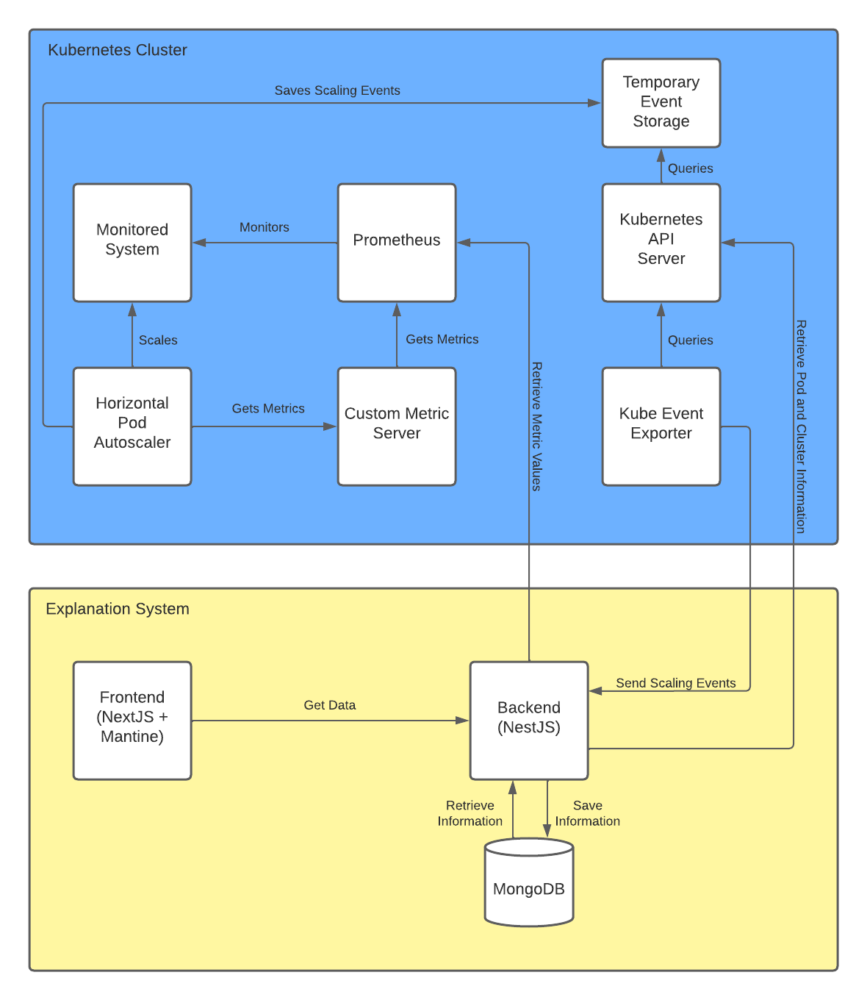

## Dear reviewers,
following is a list of repositories developed during the reasearch on the project "Explaining and Visualizing Autoscaling Behavior of Microservice Systems Deployed on Kubernetes"
The repositories are organized in the following way:
- [explaining-autoscaling-frontend](https://github.com/lMaxTl/explaining-autoscaling-frontend)
- [explaining-autoscaling-backend](https://github.com/lMaxTl/explaining-autoscaling-backend)
- [explaining-autoscaling-backend-documentation](https://lmaxtl.github.io/documentation/ba-backend/overview.html)
- [explaining-autoscaling-kubernetes-files](https://github.com/lMaxTl/explaining-autosclaing-kubernetes-files)

EXPA is a tool that addresses the problem of lack of clear explanations for autoscaling behaviour in self-adaptive microservice systems. Traditional manual monitoring of such systems is time consuming, costly and can lead to long runtime interruptions. To meet the demand for automation, self-adaptive systems have become the industry standard. However, this also results in a lack of clear explanations for adaptation decisions, making it difficult to debug and verify the behaviour of these systems. EXPA aims to solve this problem by providing explanations for adaptation decisions in Kubernetes clusters, reducing the cost of ownership and increasing resilience.

Here is an overview of the architecture of the project:


## explaining-autoscaling-frontend
This repository contains the frontend of the project. It is a React application that visualizes the autoscaling behavior of the microservice system. The frontend is connected to the backend via a REST API connection. The frontend is deployed as a docker container on a Kubernetes cluster.

Code files in the scope of this review are located in the following folders:
 - components/ - contains the ui elements of the frontend
    - components/Cards/TabbableCard - contains the card that is used to display the metrics
    - components/DependencyGraph - contains the graph that is used to display the dependency graph
    - components/Events - contains the event list
    - components/Metrics/Display - contains the saved metric list
    - components/Metrics/Information - contains components that are used to display the information of a metric
    - components/Navbars - contains the navigation bar
    - components/Pods - contains the table that is used to display information about container in a pod
    - components/ReplicaSets - contains the component that is used to display information about a replica set 
    - components/Sidebars - contains the sidebar
    - components/Timelines - contains the timeline with and without metric information
    - components/Titles - contains a dynamic title component
 - helpers/
    - helpers/DataCollection - contains the code that collects the data from the backend
    - helpers/DataManipulation - contains the code that is used to manipulate the data
    - helper/Types - contains the typescript types
 - pages/ - contains the pages of the frontend

## explaining-autoscaling-backend
This repository contains the backend of the project. It is a node.js application that collects the metrics of the microservice system. The backend is deployed as a docker container on a Kubernetes cluster.
The project extends the work of Tobias Rodestock. His work includes the following folders and are not part of the code review:
 - event-set/*
 - derivative/*
 - events.service.ts (partly, only consider receiveNewAdaptionEvent() and getAllMetricValues())


## Setup
To setup the project, you need to have a Kubernetes cluster running. The project was tested on a local Kubernetes cluster running on minikube. The project was also tested on a Kubernetes cluster running on Azure Cloud Platform.

It is recommended to use the following tools to setup the project:
- [minikube](https://minikube.sigs.k8s.io/docs/start/)
- [kubectl](https://kubernetes.io/docs/tasks/tools/install-kubectl/)
- [helm](https://helm.sh/docs/intro/install/)
- [docker](https://docs.docker.com/get-docker/)
- [node.js](https://nodejs.org/en/download/)
- [npm](https://www.npmjs.com/get-npm)

Start the minikube cluster with the following command:
```bash
minikube start --memory 8192 --cpus 6 --extra-config=kubelet.housekeeping-interval=10s
```
It is important to check that the housekeeping-interval is set to 10s. Otherwise, the metrics-server will not work properly.

### Setup dependencies
This project is closely linked to the t2-project. Therefore, the t2-project needs to be setup first. The t2-project can be found [here](https://github.com/t2-project).
To set the t2-project up, follow the instructions provided on the t2-project documentation page that can be found [here](https://t2-documentation.readthedocs.io/en/latest/guides/deploy.html)

## Get the Kubernetes YAML files
The Kubernetes YAML files are located in the following repository: [explaining-autoscaling-kubernetes-files](https://github.com/lMaxTl/explaining-autosclaing-kubernetes-files)
To get the files, you can either clone the repository or download the files as a zip file.

```bash	
git clone https://github.com/lMaxTl/explaining-autosclaing-kubernetes-files.git
```

### Setup the Custom Metric Server
The custom metric server is required so that the Horizontal Pod Autoscaler can retrieve metrics from Prometheus. The custom metric server is deployed as a docker container on the Kubernetes cluster.

```bash	
cd .\custom_metric_server\
kubectl create -f .
cd ..
```

### Setup the Kubernetes Event Exporter
The Kubernetes Event Exporter is required so that the backend can retrieve events from the Kubernetes cluster. The Kubernetes Event Exporter is deployed as a docker container on the Kubernetes cluster.

```bash
cd .\kubernetes_event_exporter\
kubectl create -f .
cd ..
```


### Setup the HPA Config for t2store
These are example configurations derived by Tobias Rodestock and are used to scale the t2store microservice system.

```bash	
cd .\hpa_config\
kubectl create -f .
cd ..
```

### Setup the EXPA backend
Sometimes the backend errors and cant reach the prometheus service and is fixed by running minikube dashboard for some reason

```bash	
cd .\expa_backend\
kubectl create -f .
cd ..
```

### Setup the EXPA frontend
```bash	
cd .\expa_backend_frontend\
kubectl create -f .
```
## Accessing the frontend
To access the frontend, you need to forward the service to your local machine. The following command forwards the service to port 9001.

```bash
kubectl port-forward svc/ba-frontend 9001:9001
```

### Setting up an ingress controller on aks
If you want to access the frontend from outside the cluster, you need to setup an ingress controller. The following command installs the nginx ingress controller on Azure Kubernetes Service (AKS).

```bash
NAMESPACE=ingress-basic

helm repo add ingress-nginx https://kubernetes.github.io/ingress-nginx
helm repo update

helm install ingress-nginx ingress-nginx/ingress-nginx \
  --create-namespace \
  --namespace $NAMESPACE \
  --set controller.service.annotations."service\.beta\.kubernetes\.io/azure-load-balancer-health-probe-request-path"=/healthz
```

After the ingress controller is installed, you need to create an ingress resource. The following command creates an ingress resource for the frontend.
Make sure that the current working directory is the folder expa_frontend.

```bash
kubectl apply -f ingress_config/frontend_ingress.yml
```

## Generating Events
You can generate load manually accessing the UI or the UIBackend’s Swagger-UI.
Or you can use a Load Generator to send request. We recommend [Apache JMeter](https://jmeter.apache.org/) for this purpose.

### Apache JMeter
To run the T2-Project with the JMeter Load Generator, do the following :
* Deploy the T2-Project
* Get JMeter
* Get a load profile and run the load generator

The load profiles can be found in the following repository: [t2-project-kube](https://github.com/t2-project/kube.git) in the folder kube/loadprofiles
The repository is most likely already cloned if you followed the instructions above.

```bash
#Forward the service
kubectl port-forward svc/uibackend-cs 8081:80

#Send load to service
java -jar .\apache-jmeter\bin\ApacheJMeter.jar -t .\kube\loadprofiles\t2-store-random-infinite.jmx -Jhostname localhost -Jport 8081 -JrampUp 1 -l logfile.log -n
```